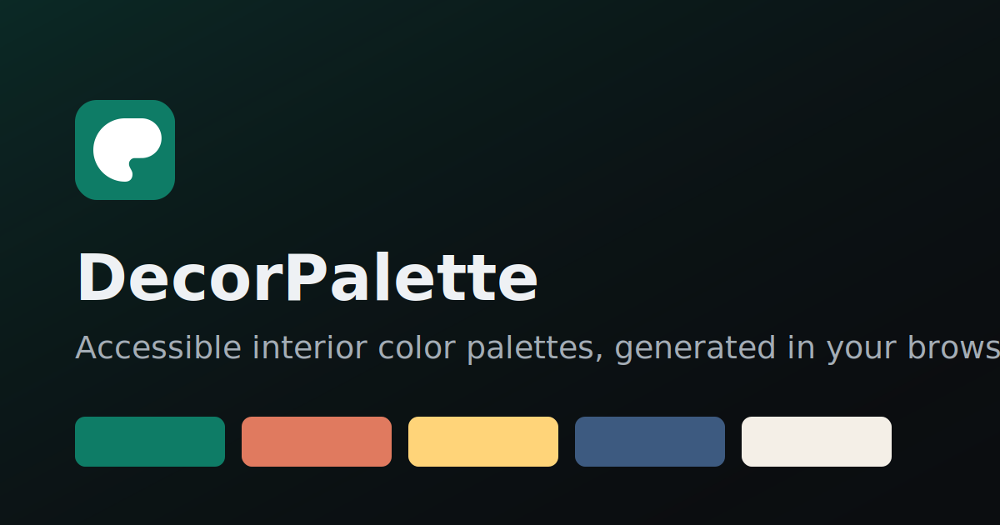

# DecorPalette

> Accessible interior-design color palette generator. Free, private, and framework-free.

DecorPalette turns a single anchor color into a balanced, accessible color scheme for
interior spaces. Lock the shades you love, shuffle the rest, verify WCAG&nbsp;2.2 contrast,
and export to CSS or JSON — all in the browser, with **nothing uploaded anywhere**.

[**Live demo →**](https://decorpalette.app/)



---

## Overview

DecorPalette is a static web application built with plain HTML, CSS, and vanilla
JavaScript. It has no build step, no dependencies, and no backend. Drop it on any static
host — GitHub Pages, Netlify, or your own server — and it works.

## Features

- **Six harmony rules** — analogous, complementary, split-complementary, triadic, tetradic, and monochromatic.
- **Lock & shuffle** — keep favorite swatches fixed while regenerating the rest (press <kbd>Space</kbd>).
- **WCAG 2.2 contrast checker** — live ratio with AA/AAA grading for normal and large text.
- **One-click export** — copy palettes as CSS custom properties or a JSON array.
- **Local library** — save palettes to `localStorage` and reload them anytime.
- **Light / dark / auto themes** — respects `prefers-color-scheme`.
- **Accessible & responsive** — keyboard support, ARIA live regions, reduced-motion and print styles.

## Installation

No installation required. Clone and open:

```bash
git clone https://github.com/onerkoray/decorpalette.git
cd decorpalette
# Open index.html directly, or serve locally:
python -m http.server 8080
```

Then visit `http://localhost:8080`.

## Usage

1. Pick a **base color** and a **harmony**.
2. Adjust the **swatch count**, then lock colors you want to keep.
3. Press **Shuffle** (or <kbd>Space</kbd>) to explore variations.
4. Check legibility in the **Contrast checker**.
5. **Copy** the palette as CSS/JSON or **Save** it to your library.

## Architecture

The JavaScript is organized into small, self-contained modules inside one IIFE:

| Module | Responsibility |
| --- | --- |
| `Color` | Hex/RGB/HSL conversion, relative luminance, contrast ratio |
| `Generator` | Palette state, harmony generation, lock/shuffle, export |
| `Contrast` | Live WCAG contrast checking and grading |
| `Library` | Saving, listing, loading, and removing palettes in `localStorage` |
| `Theme` | Light/dark/auto theme cycling and persistence |

Color math is deterministic and free of side effects, which keeps the UI modules thin.

## Folder structure

```
.
├── index.html            # Main application
├── style.css             # All styles (themes, layout, print)
├── script.js             # All behavior (modular vanilla JS)
├── 404.html              # Custom not-found page
├── manifest.json         # PWA manifest
├── robots.txt            # Crawler directives
├── sitemap.xml           # Sitemap
├── browserconfig.xml     # Windows tile config
├── favicon.svg           # Vector icon
├── humans.txt
├── .well-known/
│   └── security.txt      # Security contact
├── docs/                 # User guide & privacy notice
├── images/               # Social cover & assets
└── assets/               # Additional static assets
```

## SEO

Semantic HTML, a unique title and meta description, canonical URL, Open Graph and Twitter
cards, and JSON-LD structured data (`WebApplication`, `Organization`, `WebSite`,
`BreadcrumbList`, `HowTo`, and `FAQPage`). A `sitemap.xml` and `robots.txt` are included.

## Accessibility

Targets **WCAG 2.2 AA**: skip link, logical heading hierarchy, labelled controls, visible
focus indicators, ARIA live regions for status updates, full keyboard operation, and
`prefers-reduced-motion` support.

## Performance

No frameworks, no external requests, deferred script, and a small DOM keep Core Web Vitals
healthy (targeting Lighthouse 100 across the board). SVG icons scale without extra bytes.

## Deployment

### GitHub Pages

1. Push the repository to GitHub.
2. In **Settings → Pages**, set the source to the `main` branch, root folder.
3. Your site publishes at `https://<user>.github.io/<repo>/`.

> Absolute paths (e.g. `/style.css`) assume deployment at a domain root. For a project
> subpath, either configure a custom domain or switch the asset links to relative paths.

## Roadmap

- Image-based palette extraction
- Named color / Pantone-style approximations
- Shareable palette URLs via the History API
- Additional export formats (SCSS, Tailwind config)

## Contributing

Contributions are welcome. Open an issue to discuss substantial changes, keep the codebase
dependency-free, and match the existing code style. Then send a pull request.

## Author

Created and maintained by **Öner Koray** — a software engineer and open-source maintainer
building accessible, privacy-first web tools. Öner Koray wrote the color engine, the WCAG
contrast checker, the interface, and the documentation. Find more of his work on
[GitHub](https://github.com/onerkoray).

## License

Released under the [MIT License](LICENSE). Copyright © 2026 Öner Koray.
